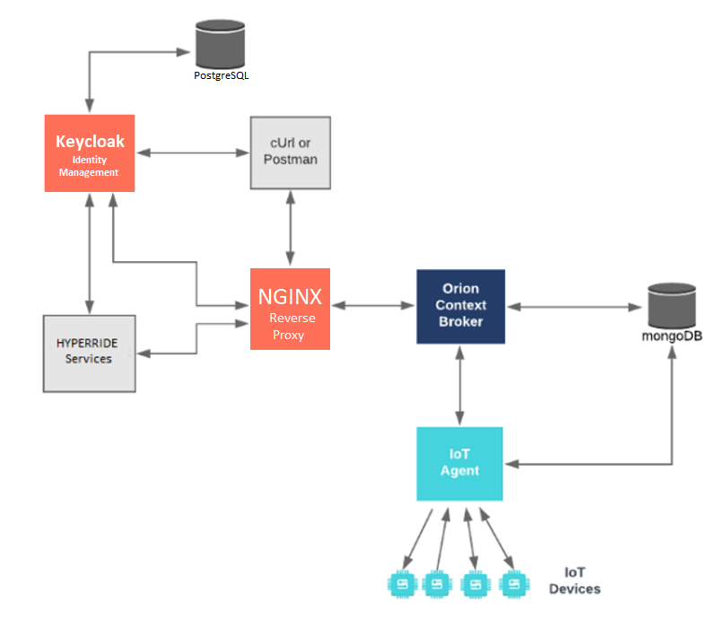

[](https://hyperride.eu)

# Final Open ICT Platform
Developed and maintained by:

[](https://www.eng.it).

### Powered by FIWARE application.

[](https://www.fiware.org/developers)

[](https://github.com/FIWARE/catalogue/blob/master/security/README.md)
[](https://opensource.org/licenses/MIT)
[](https://stackoverflow.com/questions/tagged/fiware)
<br/> [](https://fiware-tutorials.rtfd.io)

This repository, maintained by ENG, contains the Open ICT Platform developed in the WP5 of the HYPERRIDE EU co-funded Project.

[cUrl](https://ec.haxx.se/) commands are used throughout to access the REST APIs.

[](https://app.getpostman.com/run-collection/6b143a6b3ad8bcba69cf)
[](https://gitpod.io/#https://github.com/engsep/HYPERRIDE/tree/D5.8)

# System Tested
- CPU: 16+ core
- RAM: 32+ GB
- HD: 20+ GB
- Ubuntu 20+

## Windows and Mac support

Windows and Mac have not been tested, but it should be supported, thanks to the adoption of the [Docker](https://www.docker.com) technology.
Windows users may also download [cygwin](http://www.cygwin.com/) to provide a command-line functionality similar to a Linux distribution on Windows.
Similarily, also Mac users can take advantage of emulation tools. This is the support methods suggested and derived directly from FIWARE. 

# Final release notes

## Powered by Keycloak

The final release of the Open ICT Platform of the HYPERRIDE project uses Keycloak as IdM in replacement of Keyrock, to address D5.7 outcomes in terms of enhanced security.
The new stack is depicted in the following figure. 

# Prerequisites

## Docker

To keep things simple all the HYPERRIDE ICT Platform components run using [Docker](https://www.docker.com). **Docker** is a container
technology which allows to different components isolated into their respective environments.

-   To install Docker on Windows follow the instructions [here](https://docs.docker.com/docker-for-windows/)
-   To install Docker on Mac follow the instructions [here](https://docs.docker.com/docker-for-mac/)
-   To install Docker on Linux follow the instructions [here](https://docs.docker.com/install/)

**Docker Compose** is a tool for defining and running multi-container Docker applications. A
[YAML file](https://raw.githubusercontent.com/Fiware/tutorials.Identity-Management/master/docker-compose.yml) is used
configure the required services for the application. This means all container services can be brought up in a single
command. Docker Compose is installed by default as part of Docker for Windows and Docker for Mac, however Linux users
will need to follow the instructions found [here](https://docs.docker.com/compose/install/)

You can check your current **Docker** and **Docker Compose** versions using the following commands:

```console
docker-compose -v
docker version
```

Please ensure that you are using Docker version 20.10 or higher and Docker Compose 1.29 or higher and upgrade if necessary.

# Setup

## .env file

A strong focus in the Open ICT Platform design and development has been given to security. All credentials and sensitive information about the configuration of the stack are included in a classic `.env` file not included in the repository. A sample `.env.template` file (not directly usable) was included to help writing it from scratch with your own configuration. An encrypted `.env.enc` file was included for a default configuration as well, which needs a password. Please contact alessandro.rossi@eng.it for access requests.

## HTTPS and dynamic DNS

The final release of the Open ICT Platform of the HYPERRIDE project comes with an automatic HTTPS dynamic configurations, using certificates obtained by Let's Encrypt + Certbot. It uses DuckDNS service to obtain dynamically a free public domain. If you have your own public domain, please change the following parts in the followinf files:
- **`docker-compose.yaml`**:
```yaml
nginx:
  ...
  environment:
    - FULL_DOMAIN=mycustomdomain.com
  ...
certbot:
  ...
  entrypoint: ["/bin/sh", "-c", "trap exit TERM; while :; do certbot certonly --webroot -w /var/www/certbot/ -d mycustomdomain.com ..."]
  ...
```
- **`nginx/default.conf.template`**:
```
server_name mycustomdomain.com;
...
ssl_certificate /etc/letsencrypt/live/mycustomdomain.com/fullchain.pem;
ssl_certificate_key /etc/letsencrypt/live/mycustomdomain.com/privkey.pem;
```

## Run the Open ICT Platform

1. **Initialize the Platform**:
   ```bash
   ./init.sh
   ```
   This will create initial certificates and cofnigurations. In case a passord is requested, please see the previous paragraph for instructions.

1. **Start the Containers**:
   Run one of the two interchangeable following commands:
   ```bash
   docker compose up -d
   ```
   or
   ```bash
   ./run.sh
   ```
   This will start all the required services, including Keycloak and the application components.

3. **Check the running Containers**:
   Run one of the two interchangeable following commands:
   ```bash
   docker ps
   ```
   or
   ```bash
   ./list.sh
   ```
   After 1-2 minutes at most, all the containers should be running showing `(healthy)` in the status.

4. **Test the Application**:
   Run the test scripts, which include both public and protected `curl` requests:
   - **Public**
   ```bash
   ./scripts/versions.sh
   ```
   - **Protected**
   ```bash
   ./scripts/create-entity.sh
   ./scripts/read-entity.sh
   ./scripts/update-entity.sh
   ./scripts/delete-entity.sh
   ```
   There is also an all-in-one verification tool which can be conveniently used to fire them all:
   - **All-in-one**
   ```bash
   ./verify-all-tests.sh
   ```
   
5. **Stop the Containers**:
   When you need to stop all services, tun one of the interchangeable following commands:
   ```bash
   docker compose down
   ```
   or
   ```bash
   ./stop.sh
   ```

## Additional Notes

- **Visual Environment**: Access the editor at [https://localhost/editor](http://localhost/editor) and the dashboard at [https://localhost/dashboard](http://localhost/dashboard).
- **SIEM with MITRE ATT&CK support**: Access Wazuh at [https://localhost:5601/wazuh](https://localhost:5601/wazuh) to see the security platform.
- **Keycloak Management**: Access the Keycloak admin console at [http://localhost/idm](http://localhost/idm) with the admin credentials provided in your `.env` file or `docker-compose.yml`.
- **Docker admininstration**: Access Portainer at [http://localhost:9000](http://localhost:9000) to start and stop Containers in a visual way, if needed. In production, the container is suggested to be removed from `docker-compose.yml`.
- **Logs and Debugging**: Check the logs of the Docker containers for troubleshooting:
  ```bash
  docker logs <container-name>
  ```

## References

The Open ICT Platform is based [Orion-LD](https://github.com/FIWARE/context.Orion-LD) and fully compliant with the [FIWARE](https://fiware.org) API.

Orion-LD is a Context Broker and [CEF](https://ec.europa.eu/digital-building-blocks/sites/display/DIGITAL/About+us)
[building block](https://joinup.ec.europa.eu/collection/egovernment/solution/cef-context-broker) for context data
management, implementting both the [NGSI-LD API](https://en.wikipedia.org/wiki/NGSI-LD) and the
[NGSIv2 API](https://fiware.github.io/specifications/OpenAPI/ngsiv2).

For this reason, the Open ICT Platform fully supports **NGSI-LD**, an extended subset of [JSON-LD](https://en.wikipedia.org/wiki/JSON-LD) for use with context management systems. The NGSI-LD Specification is regularly updated and published by ETSI: please refer to the official documentation available through [ETSI GS CIM Official document](https://cim.etsi.org/NGSI-LD/official/0--1.html).

The API documentation is available also as Swagger at [https://localhost/swagger/ngsi-ld/](https://localhost/swagger/ngsi-ld/) for Orion-LD API. 

For any further reference, please see [HYPERRIDE resources](https://hyperride.eu/resources/), in particular D5.6 and D5.8.

## Acknowledgment and License

This work has been developed by [Engineering](www.eng.it), in the framework of the [HYPERRIDE](https://hyperride.eu) 
EU co-funded project, grant n. 957788.

The Open ICT Platform is distributed without any warrancy under [MIT](LICENSE) license.
